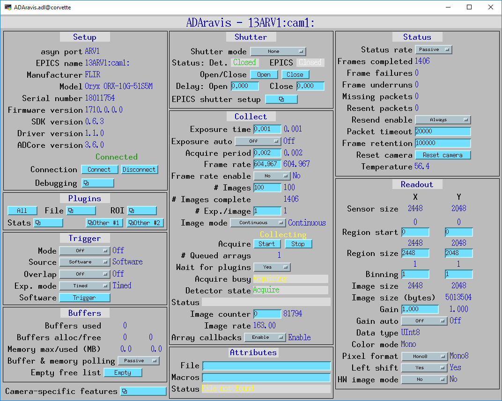

======================================
ADAravis
======================================

:author: Mark Rivers, University of Chicago

.. contents:: Contents

.. _GenICam:      https://www.emva.org/standards-technology/genicam
.. _aravis:       https://github.com/AravisProject/aravis
.. _ADGenICam:    https://github.com/areaDetector/ADGenICam
.. _ADAravis:     https://github.com/areaDetector/ADAravis
.. _aravisGigE:   https://github.com/areaDetector/aravisGigE
.. _ADSpinnaker:  https://github.com/areaDetector/ADSpinnaker
.. _ADVimba:      https://github.com/areaDetector/ADVimba
.. _ADSupport:    https://github.com/areaDetector/ADSupport

Overview
--------

This is an :doc:`../index` driver for GenICam_ cameras using the aravis_ library.

GenICam_ is a Generic Interface for Cameras from the European Machine Vision Association (EMVA). 

ADAravis is derived from the base class ADGenICam_, which handles many of the details of
mapping GenICam_ features to EPICS records. ADAravis_ is based heavily on the older aravisGigE_ 
driver which has been part of areaDetector for many years.  
ADAravis_ differs from aravisGigE_ by using the ADGenICam_ base class to significantly reduce the amount of code.
Many of the ideas in ADGenICam_ were borrowed from aravisGigE_.

As it name implies, ADAravis_ uses the aravis_ library.  It runs on most Linux systems, and can control any GenICam_ camera.
It cannot be used on Windows because aravis_ is based on the Linux-only glib library.

The aravis_ package must be built before building ADAravis.  Instructions for doing this can be found in the 
:ref:`ADGenICam installing aravis <ADGenICam_installing_aravis>` documentation.

Prior to using ADAravis with a specific camera model, the XML file must be read from the camera using the arv-tool utility, 
and the EPICS database file and OPI screens must be generated by running the Python programs in 
:ref:`ADGenICam Python scripts <ADGenICam_Python_scripts>`.

ADAravis driver
---------------
ADGenICam inherits from :doc:`../ADGenICam/ADGenICam`.  It adds some parameters and EPICS records that are
specific to ADAravis.

MEDM screens
------------
The following is the MEDM screen ADAravis.adl when controlling a FLIR Oryx 51S5M 10 Gbit Ethernet camera.
ADAravis.adl is very similar to ADGenICam.adl, with a few additional widgets for the PVs that are 
specific to ADAravis.

Note that each frame is 4.8 MB, and it is collecting 162 frames/s, which is 775 MB/s. 

The following is the MEDM screen FLIR_ORX_10g_51S5M-features1.adl when controlling a FLIR Oryx 51S5M 10 Gbit Ethernet camera.
This screen was autogenerated by the Python script in :doc:`../ADGenICam/ADGenICam`, and is specific to this camera model.
It is loaded from the "Camera-specific features" related display widget in the above screen.

.. figure:: ADAravis_features1.png
    :align: center

The following is the second feature screen generated by the Python program described above.

.. figure:: ADAravis_features2.png
    :align: center

